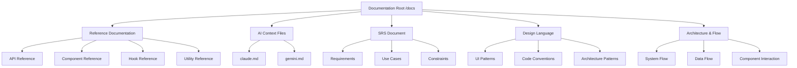
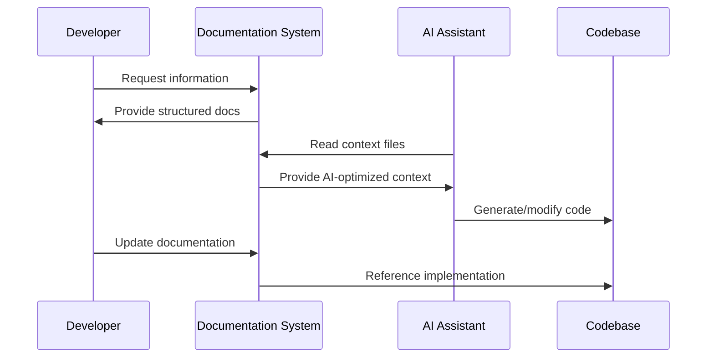

# Design Document: Comprehensive Documentation Setup

## Overview

This design establishes a complete documentation and reference system for the HyperLink P2P file transfer application. The system includes proper reference documentation, AI context files for multiple AI assistants (Claude and Gemini), a Software Requirements Specification (SRS) document, Design Language documentation, and comprehensive architecture flow documentation. The goal is to create a maintainable, discoverable, and AI-assistant-friendly documentation structure that serves developers, stakeholders, and automated tools.

## Architecture



## Main Workflow



## Components and Interfaces

### Component 1: Reference Documentation System

**Purpose**: Provide comprehensive API and component documentation for developers

**Structure**:
```pascal
STRUCTURE ReferenceDoc
  category: String  // "api", "component", "hook", "utility"
  name: String
  description: String
  parameters: Array<Parameter>
  returnType: String
  examples: Array<CodeExample>
  relatedDocs: Array<String>
END STRUCTURE

STRUCTURE Parameter
  name: String
  type: String
  required: Boolean
  description: String
  defaultValue: String
END STRUCTURE

STRUCTURE CodeExample
  title: String
  code: String
  language: String
  explanation: String
END STRUCTURE
```

**Responsibilities**:
- Document all public APIs, components, hooks, and utilities
- Provide usage examples with explanations
- Maintain cross-references between related documentation
- Include TypeScript type definitions
- Document error handling patterns

### Component 2: AI Context Files

**Purpose**: Provide AI assistants with optimized context about the codebase

**Structure**:
```pascal
STRUCTURE AIContextFile
  assistant: String  // "claude", "gemini"
  sections: Array<ContextSection>
END STRUCTURE

STRUCTURE ContextSection
  title: String
  priority: String  // "critical", "important", "reference"
  content: String
  codeReferences: Array<String>
END STRUCTURE
```

**Responsibilities**:
- Summarize project architecture for AI understanding
- Highlight critical patterns and conventions
- Provide quick reference for common tasks
- Include file structure and navigation hints
- Document testing and deployment patterns

### Component 3: Software Requirements Specification (SRS)

**Purpose**: Formal specification of system requirements and constraints

**Structure**:
```pascal
STRUCTURE SRSDocument
  introduction: Introduction
  functionalRequirements: Array<Requirement>
  nonFunctionalRequirements: Array<Requirement>
  useCases: Array<UseCase>
  constraints: Array<Constraint>
  assumptions: Array<String>
END STRUCTURE

STRUCTURE Requirement
  id: String
  category: String
  priority: String  // "must", "should", "could"
  description: String
  acceptanceCriteria: Array<String>
  dependencies: Array<String>
END STRUCTURE

STRUCTURE UseCase
  id: String
  actor: String
  preconditions: Array<String>
  mainFlow: Array<String>
  alternativeFlows: Array<AlternativeFlow>
  postconditions: Array<String>
END STRUCTURE
```

**Responsibilities**:
- Define all functional requirements
- Specify non-functional requirements (performance, security, usability)
- Document use cases with flows
- List system constraints and assumptions
- Provide traceability matrix

### Component 4: Design Language Documentation

**Purpose**: Document UI patterns, code conventions, and architectural patterns

**Structure**:
```pascal
STRUCTURE DesignLanguage
  uiPatterns: Array<UIPattern>
  codeConventions: Array<Convention>
  architecturePatterns: Array<ArchPattern>
END STRUCTURE

STRUCTURE UIPattern
  name: String
  category: String
  description: String
  usage: String
  examples: Array<CodeExample>
  dosDonts: Array<Guideline>
END STRUCTURE

STRUCTURE Convention
  category: String  // "naming", "structure", "testing"
  rule: String
  rationale: String
  examples: Array<String>
  counterExamples: Array<String>
END STRUCTURE
```

**Responsibilities**:
- Document UI component patterns
- Define naming conventions
- Specify file organization patterns
- Document testing patterns
- Provide code style guidelines

### Component 5: Architecture & Flow Documentation

**Purpose**: Document system architecture, data flow, and component interactions

**Structure**:
```pascal
STRUCTURE ArchitectureDoc
  systemOverview: String
  componentDiagrams: Array<Diagram>
  dataFlowDiagrams: Array<Diagram>
  sequenceDiagrams: Array<Diagram>
  deploymentArchitecture: DeploymentDoc
END STRUCTURE

STRUCTURE Diagram
  title: String
  type: String  // "component", "sequence", "flow"
  mermaidCode: String
  description: String
  keyPoints: Array<String>
END STRUCTURE
```

**Responsibilities**:
- Visualize system architecture
- Document data flow patterns
- Show component interactions
- Explain deployment architecture
- Provide navigation through the system

## Data Models

### Model 1: Documentation Metadata

```pascal
STRUCTURE DocumentationMetadata
  version: String
  lastUpdated: Date
  maintainers: Array<String>
  relatedFiles: Array<String>
  tags: Array<String>
END STRUCTURE
```

**Validation Rules**:
- Version must follow semantic versioning
- lastUpdated must be ISO 8601 format
- At least one maintainer required

### Model 2: Cross-Reference Index

```pascal
STRUCTURE CrossReference
  sourceDoc: String
  targetDoc: String
  referenceType: String  // "related", "dependency", "example"
  description: String
END STRUCTURE
```

**Validation Rules**:
- Both sourceDoc and targetDoc must exist
- referenceType must be from allowed list
- No circular references allowed

## Algorithmic Pseudocode

### Main Documentation Generation Algorithm

```pascal
ALGORITHM generateDocumentation(codebase)
INPUT: codebase of type Codebase
OUTPUT: documentationSet of type DocumentationSet

BEGIN
  ASSERT codebase.isValid() = true
  
  // Step 1: Analyze codebase structure
  structure ← analyzeCodebaseStructure(codebase)
  
  // Step 2: Generate reference documentation
  referenceDocs ← EMPTY_ARRAY
  FOR each component IN structure.components DO
    ASSERT component.hasPublicAPI()
    
    doc ← generateReferenceDoc(component)
    referenceDocs.add(doc)
  END FOR
  
  // Step 3: Generate AI context files
  aiContexts ← generateAIContextFiles(structure, referenceDocs)
  
  // Step 4: Generate SRS document
  srsDoc ← generateSRSDocument(structure, requirements)
  
  // Step 5: Generate design language documentation
  designLang ← generateDesignLanguage(structure, patterns)
  
  // Step 6: Generate architecture documentation
  archDocs ← generateArchitectureDocs(structure)
  
  // Step 7: Create cross-references
  crossRefs ← buildCrossReferences(referenceDocs, srsDoc, designLang, archDocs)
  
  ASSERT allDocsValid(referenceDocs, aiContexts, srsDoc, designLang, archDocs)
  
  RETURN DocumentationSet(referenceDocs, aiContexts, srsDoc, designLang, archDocs, crossRefs)
END
```

**Preconditions**:
- codebase is accessible and well-formed
- All source files are parseable
- Required metadata is available

**Postconditions**:
- All documentation files are generated
- Cross-references are valid and bidirectional
- Documentation is internally consistent

**Loop Invariants**:
- All processed components have valid documentation
- Cross-reference index remains consistent

### Reference Documentation Generation Algorithm

```pascal
ALGORITHM generateReferenceDoc(component)
INPUT: component of type Component
OUTPUT: referenceDoc of type ReferenceDoc

BEGIN
  ASSERT component.hasPublicAPI() = true
  
  // Extract component metadata
  metadata ← extractMetadata(component)
  
  // Parse function signatures
  functions ← EMPTY_ARRAY
  FOR each func IN component.publicFunctions DO
    signature ← parseSignature(func)
    params ← extractParameters(func)
    returnType ← extractReturnType(func)
    examples ← findExamples(func, component.tests)
    
    funcDoc ← FunctionDoc(signature, params, returnType, examples)
    functions.add(funcDoc)
  END FOR
  
  // Generate usage examples
  examples ← generateUsageExamples(component, functions)
  
  // Find related documentation
  related ← findRelatedDocs(component, allComponents)
  
  doc ← ReferenceDoc(metadata, functions, examples, related)
  
  ASSERT doc.isComplete() AND doc.hasExamples()
  
  RETURN doc
END
```

**Preconditions**:
- component has at least one public function or export
- component source code is parseable
- Test files are available for example extraction

**Postconditions**:
- Reference doc contains all public APIs
- At least one usage example is provided
- All cross-references are valid

### AI Context File Generation Algorithm

```pascal
ALGORITHM generateAIContextFiles(structure, referenceDocs)
INPUT: structure of type CodebaseStructure, referenceDocs of type Array<ReferenceDoc>
OUTPUT: aiContexts of type Array<AIContextFile>

BEGIN
  aiContexts ← EMPTY_ARRAY
  
  FOR each assistant IN ["claude", "gemini"] DO
    sections ← EMPTY_ARRAY
    
    // Critical: Project overview
    overview ← createOverviewSection(structure, assistant)
    sections.add(overview)
    
    // Critical: Architecture patterns
    archPatterns ← createArchitectureSection(structure, assistant)
    sections.add(archPatterns)
    
    // Important: Key components
    keyComponents ← createComponentsSection(referenceDocs, assistant)
    sections.add(keyComponents)
    
    // Important: Common tasks
    commonTasks ← createTasksSection(structure, assistant)
    sections.add(commonTasks)
    
    // Reference: File structure
    fileStructure ← createFileStructureSection(structure, assistant)
    sections.add(fileStructure)
    
    // Reference: Testing patterns
    testingPatterns ← createTestingSection(structure, assistant)
    sections.add(testingPatterns)
    
    contextFile ← AIContextFile(assistant, sections)
    aiContexts.add(contextFile)
  END FOR
  
  ASSERT aiContexts.length = 2
  
  RETURN aiContexts
END
```

**Preconditions**:
- structure contains complete codebase analysis
- referenceDocs are generated and valid
- Assistant-specific formatting rules are defined

**Postconditions**:
- One context file per AI assistant
- All sections are properly formatted
- Critical information is prioritized

## Key Functions with Formal Specifications

### Function 1: analyzeCodebaseStructure()

```pascal
FUNCTION analyzeCodebaseStructure(codebase: Codebase): CodebaseStructure
```

**Preconditions**:
- codebase directory exists and is readable
- All source files are valid TypeScript/JavaScript
- package.json exists and is valid

**Postconditions**:
- Returns complete structure analysis
- All components are categorized correctly
- Dependencies are mapped accurately

**Loop Invariants**: N/A (uses recursive traversal)

### Function 2: buildCrossReferences()

```pascal
FUNCTION buildCrossReferences(docs: Array<Document>): Array<CrossReference>
```

**Preconditions**:
- All documents in docs array are valid
- Documents have unique identifiers
- Reference links are well-formed

**Postconditions**:
- Returns bidirectional cross-reference index
- No circular references exist
- All references point to existing documents

**Loop Invariants**:
- All processed documents have valid cross-references
- Reference index remains acyclic

### Function 3: validateDocumentation()

```pascal
FUNCTION validateDocumentation(docSet: DocumentationSet): ValidationResult
```

**Preconditions**:
- docSet contains all required documentation types
- All documents are parseable

**Postconditions**:
- Returns validation result with errors/warnings
- Identifies missing cross-references
- Checks for broken links

## Example Usage

```pascal
// Example 1: Generate complete documentation
SEQUENCE
  codebase ← loadCodebase("./")
  requirements ← loadRequirements("./requirements.yaml")
  patterns ← loadPatterns("./patterns.yaml")
  
  docSet ← generateDocumentation(codebase, requirements, patterns)
  
  writeDocumentation(docSet, "./docs")
  
  validation ← validateDocumentation(docSet)
  IF validation.hasErrors() THEN
    DISPLAY validation.errors
  END IF
END SEQUENCE

// Example 2: Update AI context files only
SEQUENCE
  structure ← analyzeCodebaseStructure(codebase)
  referenceDocs ← loadExistingReferenceDocs("./docs/reference")
  
  aiContexts ← generateAIContextFiles(structure, referenceDocs)
  
  writeAIContextFiles(aiContexts, "./docs")
END SEQUENCE

// Example 3: Generate reference doc for single component
SEQUENCE
  component ← loadComponent("./src/components/FileTransfer.tsx")
  
  IF component.hasPublicAPI() THEN
    doc ← generateReferenceDoc(component)
    writeReferenceDoc(doc, "./docs/reference/components")
  ELSE
    DISPLAY "Component has no public API"
  END IF
END SEQUENCE
```

## Correctness Properties

### Property 1: Documentation Completeness
```pascal
PROPERTY documentationCompleteness
  FORALL component IN codebase.publicComponents:
    EXISTS doc IN documentationSet.referenceDocs:
      doc.component = component AND
      doc.hasExamples() AND
      doc.hasTypeDefinitions()
```

### Property 2: Cross-Reference Validity
```pascal
PROPERTY crossReferenceValidity
  FORALL ref IN documentationSet.crossReferences:
    EXISTS sourceDoc IN documentationSet:
      sourceDoc.id = ref.sourceDoc AND
    EXISTS targetDoc IN documentationSet:
      targetDoc.id = ref.targetDoc
```

### Property 3: AI Context Completeness
```pascal
PROPERTY aiContextCompleteness
  FORALL assistant IN ["claude", "gemini"]:
    EXISTS contextFile IN documentationSet.aiContexts:
      contextFile.assistant = assistant AND
      contextFile.hasCriticalSections() AND
      contextFile.hasCodeReferences()
```

### Property 4: SRS Traceability
```pascal
PROPERTY srsTraceability
  FORALL requirement IN srsDocument.functionalRequirements:
    EXISTS useCase IN srsDocument.useCases:
      useCase.satisfies(requirement) AND
    EXISTS component IN codebase:
      component.implements(requirement)
```

### Property 5: Documentation Consistency
```pascal
PROPERTY documentationConsistency
  FORALL doc1, doc2 IN documentationSet:
    IF doc1.references(doc2) THEN
      doc1.terminology = doc2.terminology AND
      doc1.version.compatible(doc2.version)
```

## Error Handling

### Error Scenario 1: Missing Component Documentation

**Condition**: Public component exists in codebase but has no reference documentation
**Response**: Generate warning with component path and missing documentation types
**Recovery**: Auto-generate skeleton documentation with placeholders

### Error Scenario 2: Broken Cross-Reference

**Condition**: Documentation references a file or component that doesn't exist
**Response**: Log error with source document and broken reference
**Recovery**: Remove broken reference and suggest alternatives

### Error Scenario 3: Outdated AI Context

**Condition**: Codebase structure has changed significantly since last AI context generation
**Response**: Display warning about stale context files
**Recovery**: Trigger automatic regeneration of AI context files

### Error Scenario 4: Invalid SRS Requirement

**Condition**: Requirement has no corresponding use case or implementation
**Response**: Flag requirement as unimplemented in validation report
**Recovery**: Prompt for use case creation or requirement removal

### Error Scenario 5: Inconsistent Terminology

**Condition**: Same concept is referred to with different terms across documents
**Response**: Generate terminology consistency report
**Recovery**: Suggest standardized terminology and auto-fix options

## Testing Strategy

### Unit Testing Approach

Test individual documentation generation functions in isolation:

**Key Test Cases**:
- `analyzeCodebaseStructure()` correctly identifies all components
- `generateReferenceDoc()` extracts all public APIs
- `buildCrossReferences()` creates valid bidirectional links
- `validateDocumentation()` catches all error types
- Metadata extraction handles edge cases (no JSDoc, complex types)

**Coverage Goals**: 90%+ for all generation and validation functions

### Property-Based Testing Approach

**Property Test Library**: fast-check (for TypeScript/JavaScript)

**Properties to Test**:
1. **Idempotency**: Generating documentation twice produces identical output
2. **Completeness**: All public APIs have documentation
3. **Validity**: All cross-references point to existing documents
4. **Consistency**: Terminology is consistent across all documents
5. **Acyclicity**: Cross-reference graph has no cycles

**Example Property Test**:
```typescript
import fc from 'fast-check';

test('documentation generation is idempotent', () => {
  fc.assert(
    fc.property(fc.codebase(), (codebase) => {
      const docs1 = generateDocumentation(codebase);
      const docs2 = generateDocumentation(codebase);
      expect(docs1).toEqual(docs2);
    })
  );
});
```

### Integration Testing Approach

Test the complete documentation generation pipeline:

**Test Scenarios**:
1. Generate documentation for sample monorepo
2. Verify all expected files are created
3. Validate cross-references between documents
4. Test AI context file format for both assistants
5. Verify SRS document completeness
6. Test documentation update workflow (incremental changes)

**Validation**:
- All expected documentation files exist
- No broken links or references
- AI context files are parseable by target assistants
- SRS document passes formal validation

## Performance Considerations

**Documentation Generation Performance**:
- Large codebases (1000+ files) should complete in < 5 minutes
- Incremental updates should complete in < 30 seconds
- Use caching for unchanged components
- Parallelize independent documentation generation tasks

**Memory Constraints**:
- Stream large files instead of loading entirely into memory
- Use incremental parsing for TypeScript AST analysis
- Limit concurrent file processing to prevent memory exhaustion

**Optimization Strategies**:
- Cache parsed AST for unchanged files
- Use worker threads for parallel processing
- Implement lazy loading for cross-reference resolution
- Index documentation for fast search

## Security Considerations

**Documentation Security**:
- Sanitize all code examples to remove sensitive data (API keys, credentials)
- Validate all file paths to prevent directory traversal
- Escape special characters in generated markdown
- Limit file system access to designated documentation directories

**AI Context Security**:
- Exclude sensitive configuration from AI context files
- Redact internal URLs and infrastructure details
- Review generated context for information leakage
- Version control AI context files for audit trail

**Access Control**:
- Documentation generation should run with minimal privileges
- Restrict write access to documentation directories
- Validate all input files before processing
- Log all documentation generation activities

## Dependencies

**Core Dependencies**:
- TypeScript Compiler API (for AST parsing)
- Markdown parser and generator (e.g., remark, unified)
- YAML parser (for configuration files)
- File system utilities (fs-extra)

**Optional Dependencies**:
- Mermaid CLI (for diagram generation)
- Prettier (for code formatting in examples)
- ESLint (for code validation in examples)
- JSON Schema validator (for SRS validation)

**Development Dependencies**:
- Vitest (for unit testing)
- fast-check (for property-based testing)
- TypeScript (for type checking)
- ts-node (for running generation scripts)
