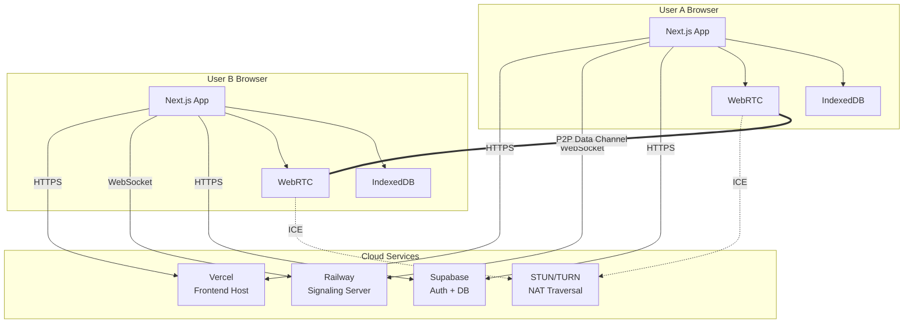
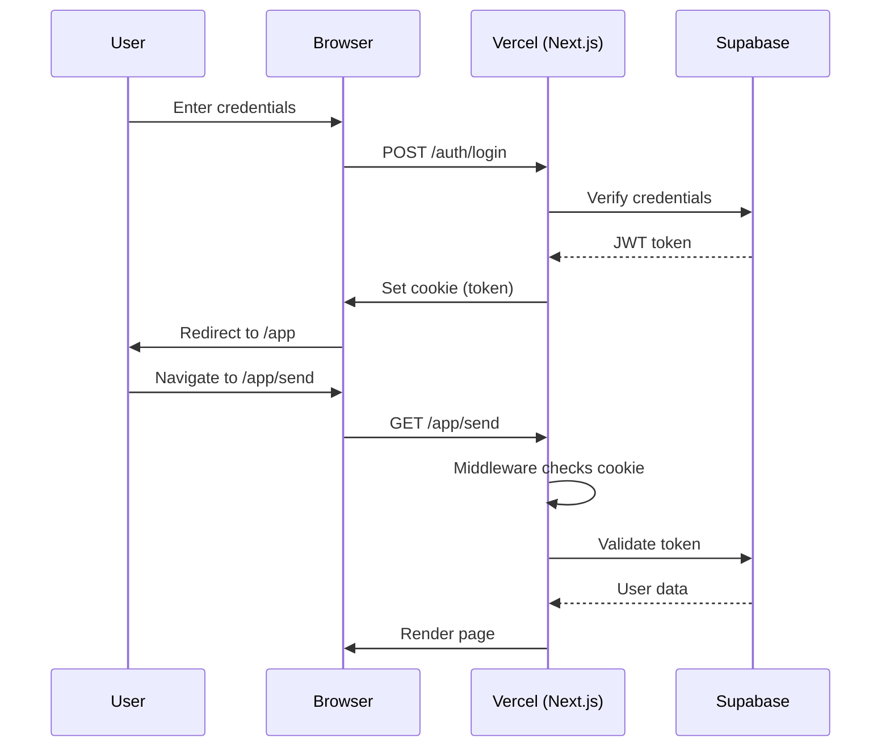
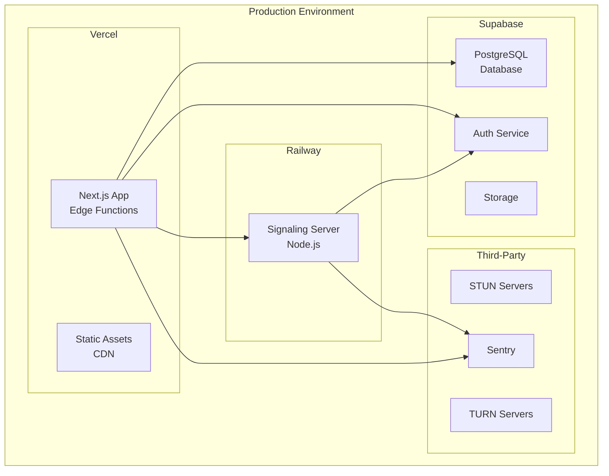
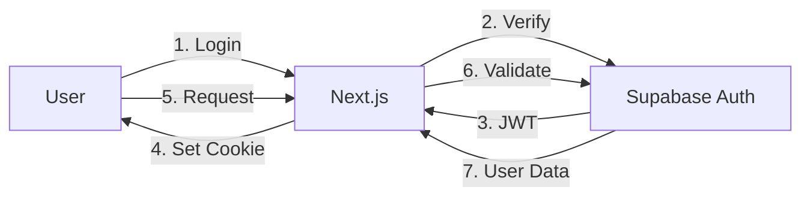

# HyperLink System Architecture Overview

## Table of Contents
1. [High-Level Architecture](#high-level-architecture)
2. [System Components](#system-components)
3. [Data Flow](#data-flow)
4. [Technology Stack](#technology-stack)
5. [Deployment Architecture](#deployment-architecture)
6. [Security Architecture](#security-architecture)

## High-Level Architecture

HyperLink uses a hybrid architecture combining centralized services (authentication, signaling) with decentralized P2P file transfer.



### Architecture Principles

1. **Privacy First**: Files never touch servers - only P2P transfer
2. **Zero Memory**: Stream files in chunks to avoid memory overflow
3. **Hybrid Cloud**: Centralized for discovery, decentralized for transfer
4. **Progressive Enhancement**: Fallback strategies for restricted networks
5. **Offline Capable**: PWA with service worker for offline access

## System Components

### 1. Frontend Application (Next.js)

**Location**: `apps/web/`

**Purpose**: User interface and client-side logic

**Key Features**:
- Server-side rendering for fast initial load
- App Router for file-based routing
- React Server Components for data fetching
- Client Components for interactivity

**Structure**:
```
apps/web/src/
├── app/                    # Next.js App Router
│   ├── (auth)/            # Auth pages (login, signup)
│   ├── (protected)/       # Protected pages (app, send, receive)
│   ├── api/               # API routes
│   └── layout.tsx         # Root layout
├── components/            # React components
│   ├── transfer/          # Transfer-related components
│   ├── history/           # History components
│   ├── peer/              # Peer connection components
│   └── ui/                # Reusable UI components
├── lib/                   # Core logic
│   ├── transfer/          # File transfer protocol
│   ├── peer/              # WebRTC management
│   ├── storage/           # IndexedDB utilities
│   ├── hooks/             # Custom React hooks
│   └── supabase/          # Supabase clients
└── middleware.ts          # Auth middleware
```

### 2. Signaling Server (PeerServer)

**Location**: `apps/signaling/`

**Purpose**: WebRTC peer discovery and connection establishment

**Technology**: Node.js + Express + PeerJS Server

**Responsibilities**:
- Register peers with unique IDs
- Facilitate WebRTC signaling (SDP exchange)
- Relay ICE candidates
- Authenticate connections via JWT

**Key Features**:
- JWT authentication (validates Supabase tokens)
- Rate limiting (100 requests per 15 minutes)
- CORS protection
- Health check endpoint

**Code**:
```typescript
// apps/signaling/src/index.ts
import { ExpressPeerServer } from 'peer';
import express from 'express';
import jwt from 'jsonwebtoken';

const app = express();

// JWT authentication middleware
app.use('/myapp', (req, res, next) => {
  const token = req.headers.authorization?.split(' ')[1];
  if (!token) return res.status(401).json({ error: 'Unauthorized' });
  
  try {
    jwt.verify(token, process.env.SUPABASE_JWT_SECRET!);
    next();
  } catch {
    res.status(401).json({ error: 'Invalid token' });
  }
});

const server = app.listen(PORT);
const peerServer = ExpressPeerServer(server, {
  path: '/myapp',
  allow_discovery: false, // Security: disable peer listing
});

app.use('/myapp', peerServer);
```

### 3. Database (Supabase PostgreSQL)

**Purpose**: Store user data and transfer metadata

**Tables**:

```sql
-- User profiles (extends auth.users)
CREATE TABLE profiles (
  id UUID PRIMARY KEY REFERENCES auth.users(id),
  email TEXT NOT NULL,
  created_at TIMESTAMPTZ DEFAULT NOW(),
  updated_at TIMESTAMPTZ DEFAULT NOW()
);

-- Transfer metadata
CREATE TABLE transfers (
  id UUID PRIMARY KEY DEFAULT uuid_generate_v4(),
  file_name TEXT NOT NULL,
  file_size BIGINT NOT NULL,
  file_type TEXT,
  status TEXT NOT NULL, -- 'pending', 'transferring', 'completed', 'failed', 'cancelled'
  created_at TIMESTAMPTZ DEFAULT NOW(),
  completed_at TIMESTAMPTZ,
  error_message TEXT
);

-- Transfer participants (many-to-many)
CREATE TABLE transfer_participants (
  id UUID PRIMARY KEY DEFAULT uuid_generate_v4(),
  transfer_id UUID REFERENCES transfers(id) ON DELETE CASCADE,
  user_id UUID REFERENCES profiles(id) ON DELETE CASCADE,
  role TEXT NOT NULL, -- 'sender' or 'receiver'
  created_at TIMESTAMPTZ DEFAULT NOW(),
  UNIQUE(transfer_id, user_id, role)
);
```

**Row Level Security (RLS)**:
```sql
-- Users can only see their own transfers
CREATE POLICY "Users can view own transfers"
  ON transfers FOR SELECT
  USING (
    EXISTS (
      SELECT 1 FROM transfer_participants
      WHERE transfer_id = transfers.id
      AND user_id = auth.uid()
    )
  );
```

### 4. Authentication (Supabase Auth)

**Purpose**: Secure user authentication

**Features**:
- Email/password authentication
- Session management with JWT
- Password reset via email
- Email confirmation

**Integration**:
```typescript
// Client-side
import { createClient } from '@/lib/supabase/client';

const supabase = createClient();
const { data: { user } } = await supabase.auth.getUser();

// Server-side (API routes, Server Components)
import { createClient } from '@/lib/supabase/server';

const supabase = createClient();
// Automatically uses cookies for auth
```

### 5. Storage (IndexedDB)

**Purpose**: Client-side storage for file chunks during transfer

**Database**: `hyperlink-db`

**Stores**:
```typescript
// Chunk storage
interface ChunkStore {
  key: string;  // `${transferId}-${chunkIndex}`
  value: Uint8Array;  // Chunk data
}

// Metadata storage
interface MetadataStore {
  key: string;  // transferId
  value: {
    fileName: string;
    fileSize: number;
    totalChunks: number;
    receivedChunks: number[];
    createdAt: number;
  };
}
```

**Usage**:
```typescript
import { openDB } from 'idb';

const db = await openDB('hyperlink-db', 1, {
  upgrade(db) {
    db.createObjectStore('chunks');
    db.createObjectStore('metadata');
  }
});

// Write chunk
await db.put('chunks', chunkData, `${transferId}-${chunkIndex}`);

// Read metadata
const metadata = await db.get('metadata', transferId);
```

## Data Flow

### File Transfer Flow

```mermaid
sequenceDiagram
    participant S as Sender
    participant SC as Sender's Browser
    participant SS as Signaling Server
    participant RC as Receiver's Browser
    participant R as Receiver
    
    S->>SC: Select file
    SC->>SS: Register peer (Sender ID)
    SS-->>SC: Peer registered
    SC->>S: Display connection code
    
    S->>R: Share code (out of band)
    
    R->>RC: Enter code
    RC->>SS: Connect to Sender ID
    SS->>SC: Connection request
    SC->>RC: WebRTC offer (SDP)
    RC->>SC: WebRTC answer (SDP)
    SC<-->RC: ICE candidate exchange
    SC<-->RC: Data channel established
    
    S->>SC: Start transfer
    
    loop For each chunk
        SC->>SC: Read 64KB chunk
        SC->>RC: Send chunk
        RC->>RC: Write to IndexedDB
        RC->>SC: Send ACK
    end
    
    RC->>RC: Assemble file
    RC->>R: Download file
    
    SC->>Supabase: Save transfer metadata
    RC->>Supabase: Save transfer metadata
```

### Authentication Flow



## Technology Stack

### Frontend
| Technology | Version | Purpose |
|------------|---------|---------|
| Next.js | 14.2+ | React framework with SSR |
| React | 18.3+ | UI library |
| TypeScript | 5.3+ | Type safety |
| Tailwind CSS | 3.4+ | Styling |
| PeerJS | 1.5+ | WebRTC wrapper |
| idb | 8.0+ | IndexedDB wrapper |

### Backend
| Technology | Version | Purpose |
|------------|---------|---------|
| Node.js | 20+ | Runtime |
| Express | 4.18+ | Web framework |
| PeerServer | 1.0+ | Signaling server |
| jsonwebtoken | 9.0+ | JWT validation |

### Database & Auth
| Technology | Purpose |
|------------|---------|
| Supabase | Auth + PostgreSQL |
| PostgreSQL | 15+ | Relational database |

### DevOps
| Technology | Purpose |
|------------|---------|
| Vercel | Frontend hosting |
| Railway | Signaling server hosting |
| GitHub Actions | CI/CD |
| Sentry | Error tracking |

### Testing
| Technology | Purpose |
|------------|---------|
| Vitest | Unit testing |
| Playwright | E2E testing |
| Testing Library | React testing |

## Deployment Architecture



### Deployment Details

**Frontend (Vercel)**:
- Auto-deploys from `main` branch
- Edge functions for API routes
- Global CDN for static assets
- Automatic HTTPS
- Environment variables managed in dashboard

**Signaling Server (Railway)**:
- Auto-deploys from `main` branch
- Single instance (stateless)
- Health check endpoint: `/health`
- Environment variables managed in dashboard
- Automatic HTTPS

**Database (Supabase)**:
- Managed PostgreSQL instance
- Automatic backups
- Connection pooling
- Row Level Security enabled

## Security Architecture

### Authentication Security



**Security Measures**:
- Passwords hashed with bcrypt
- JWT tokens with expiration
- HTTP-only cookies
- HTTPS enforced
- CSRF protection

### Data Transfer Security

**WebRTC Security**:
- DTLS encryption (mandatory)
- SRTP for media (not used)
- End-to-end encryption by default
- No server can decrypt data

**Signaling Security**:
- JWT authentication required
- Rate limiting (100 req/15min)
- CORS restrictions
- No peer discovery (privacy)

### Database Security

**Row Level Security (RLS)**:
```sql
-- Example: Users can only access their own data
CREATE POLICY "Users access own data"
  ON table_name
  FOR ALL
  USING (user_id = auth.uid());
```

**API Security**:
- All API routes check authentication
- Input validation on all endpoints
- SQL injection prevention (parameterized queries)
- XSS prevention (sanitized outputs)

### Storage Security

**IndexedDB**:
- Origin-isolated (same-origin policy)
- No cross-site access
- Encrypted at rest by OS
- Quota limits prevent abuse

---

**Last Updated**: 2024  
**Maintainer**: HyperLink Team  
**Version**: 1.0.0
